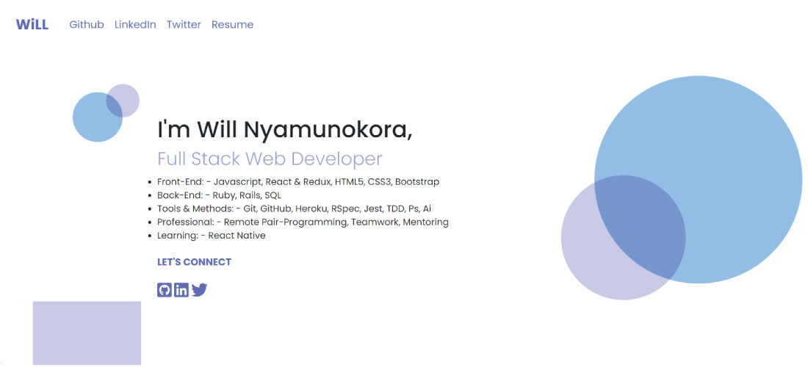

# Web Development Portfolio

- This portfolio showcases the projects I have built.
- The portfolio site is built using JS and Bootstrap using Webpack.

## Portfolio URL

[https://bigwizzo.github.io/portfolio/](https://bigwizzo.github.io/portfolio/)

## Built With

- Javascript
- HTML
- Webpack
- CSS
- Bootstrap

## Authors

👤 **Will Nyamunokora**

- Github: [@bigwizzo](https://github.com/bigwizzo)
- Twitter: [@willnyamunokora](https://twitter.com/willnyamunokora)
- Linkedin: [@willnyamunokora](https://linkedin.com/in/willnyamunokora)

## 🤝 Contributing

Contributions, issues and feature requests are welcome!

Feel free to check the [issues page](https://github.com/bigwizzo/portfolio/issues).

## Show your support

Give a ⭐️ if you like this project!

## Acknowledgments

- Microverse
- Stand up Team
- TSEs

## 📝 License

This project is [MIT](https://opensource.org/licenses/MIT) licensed.
